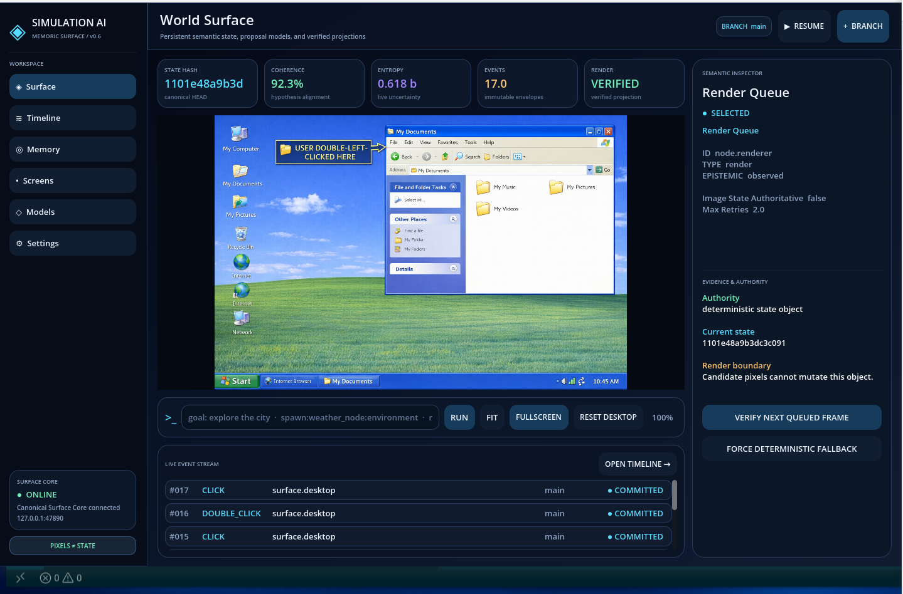

# Simulation AI

Simulation AI is a desktop world model that learns what happened on a visual computer surface and generates the next screen after the user interacts with it.



## 1. Simple explanation

Think of Simulation AI as a AI generated computer desktop that can remember its previous screens.

You can click the Start menu, double-click an icon, right-click a taskbar item, hover over a control, or type into a mapped text box. The system records where the interaction happened, paints an annotation over the clicked location, asks a vision observer what the user interacted with, and asks an image model to create the next desktop frame.

The important difference is that the generated image is treated as a visual proposal. The system keeps the interaction history, desktop geometry, object identity, and uncertainty separately so one inaccurate generated image does not silently redefine the world.

The project has two main parts:

- Godot is the interactive desktop cockpit and visual surface.
- Python Surface Core is the local authority that validates interactions, stores history, protects credentials, and coordinates model calls.

The first boot can restore the most recent encrypted desktop frame. New images are stored in an AES-GCM encrypted SQLite database. The original desktop can be restored with `RESET DESKTOP`.

## 2. Practical technical overview

### Runtime flow

```text
Godot input
    ↓
click / hover / typing capture
    ↓
source-image coordinate mapping
    ↓
annotated desktop frame
    ↓
Gemma visual observation
    ↓
deterministic interaction validation
    ↓
OpenAI image edit of the previous frame
    ↓
encrypted SQLite image history
    ↓
next desktop projection
```

The desktop is rendered at a `1536×1024` source coordinate space. When it is fitted into a smaller docked panel, pointer coordinates are converted back into source-image coordinates before they reach the vision pipeline. This prevents a click near the taskbar or clock from being interpreted using the wrong scale.

Supported interaction classes include:

- left click;
- right click;
- single and double click;
- hover region classification;
- taskbar process and system-tray mapping;
- Start-menu and shortcut mapping;
- text-box focus and typing capture.

The boot screen supports Windows 95, Windows XP, Windows 7, Windows 10, Windows 11, Windows 12, Linux Ubuntu, and macOS-style desktop prompts.

### Local setup

Requirements: Git, Python 3.11+, and Godot 4.7+.

```bash
git clone <repository-url>
cd simulation-ai
./scripts/run-dev.sh
```

The launcher creates `.runtime/venv`, installs the local Python package, starts the loopback Surface Core, and launches Godot. To install the optional LiteRT-LM Gemma runtime:

```bash
SIMULATION_AI_WITH_GEMMA=1 ./scripts/run-dev.sh
```

The core listens on `127.0.0.1:47890` by default. The backend can also be started directly:

```bash
PYTHONPATH=core/src python -m simulation_ai.server
```

### Credentials and image history

OpenAI keys are stored in an encrypted password-wrapped vault. The password is never stored, so the vault password is required after a restart.

Images are stored as encrypted AES-GCM BLOBs in:

```text
.simulation-ai/images.sqlite3
```

The UI materializes a temporary decrypted copy only when it needs to display an image. Models, credentials, databases, virtual environments, image caches, and binaries are excluded from Git.

### Build standalone packages

GitHub Actions builds Godot and the Python backend together for Linux, Windows, and macOS using [.github/workflows/build.yml](.github/workflows/build.yml). The macOS release is a mountable `Simulation-AI-macOS-universal.dmg` containing the universal `.app` and an `/Applications` shortcut.

Each package contains:

- a Godot desktop executable;
- a PyInstaller `simulation-ai-core` backend executable;
- a `backend/` runtime that Godot starts automatically (embedded inside the macOS app bundle and stored beside the desktop executable on Linux and Windows).

The local backend packaging command is:

```bash
python3 -m pip install -e core pyinstaller
python3 scripts/package_backend.py
```

### Tests

```bash
python3 -m compileall -q core/src scripts
python3 scripts/check-godot-structure.py
python3 -m pytest -q core/tests
```

## 3. Technical description and research note

### Abstract

Simulation AI implements a deterministic world-surface runtime for persistent visual computer environments. A user interaction is represented as a structured event containing gesture type, source-image coordinates, target description, privacy policy, parent state hash, and evidence references. Model outputs are restricted to observation, proposal, routing, or candidate-render roles. A deterministic reducer remains the only authority allowed to commit semantic state.

The visual projection is therefore not the memory itself. It is a candidate measurement of a state maintained across geometry, identity, affordances, causal relations, temporal order, and uncertainty. This allows the system to preserve useful ambiguity rather than collapsing every generated frame into a new fact.

### Memoric mapping surfaces

Let the world representation at time (t) be:

\[
\mathcal{M}_t = \{G_t, I_t, A_t, C_t, T_t, U_t\}
\]

where:

- (G_t) is geometry and occupancy;
- (I_t) is persistent object identity;
- (A_t) is the affordance and interaction surface;
- (C_t) is causal dependency structure;
- (T_t) is temporal ordering and phase;
- (U_t) is ambiguity and unresolved alternatives.

Each deposited constraint can be represented as:

\[
m_{t,x} = (z_{t,x}, \phi_{t,x}, q_{t,x}, \kappa_{t,x})
\]

where (z) is latent content, (phi) is relational phase, (q) is confidence mass, and (kappa) is the active constraint set.

### Quantum-inspired register

The implementation uses a classical approximation of a positive normalized hypothesis register:

\[
\rho_t \succeq 0, \qquad \operatorname{Tr}(\rho_t)=1
\]

with a mixture of possible interpretations:

\[
\rho_t = \sum_{k=1}^{K} p_{t,k}\,|\psi_{t,k}\rangle\langle\psi_{t,k}|.
\]

No physical qubits or quantum-computing claims are required. In the implementation, the register is represented by structured JSON surfaces, weighted hypotheses, confidence values, contradiction records, and entropy statistics.

An observation updates the register conceptually through an evidence operator (B(o)):

\[
\rho_{t+1} =
\frac{B(o_{t+1})\,\widetilde{\rho}_{t+1}\,B(o_{t+1})^\dagger}
{\operatorname{Tr}[B(o_{t+1})\,\widetilde{\rho}_{t+1}\,B(o_{t+1})^\dagger]}.
\]

The current runtime approximates this update by depositing interaction constraints, updating confidence and entropy, retaining unresolved alternatives, and passing the resulting context to the render director.

### Resonance and constraint satisfaction

Instead of retrieving one visually similar frame, a future Memoric resolver can score distributed constraint resonance:

\[
r_j = \operatorname{Tr}(\rho_t M_j)
 + \lambda_\phi\cos(\phi_t-\phi_j)
 - \lambda_c\mathcal{V}(\rho_t,\kappa_j).
\]

Here (M_j) is a surface operator and (mathcal{V}) measures violations of accumulated constraints. A desktop frame can therefore combine the geometry of one prior state, the identity trajectory of an icon, and the causal behavior of a taskbar process without pretending that all evidence came from one historical screenshot.

### Entropy attuning

The system should preserve ambiguity when a surface is novel, occluded, risky, or weakly observed, while becoming more definite when constraints are strong. Register entropy is:

\[
H(\rho_t) = -\operatorname{Tr}(\rho_t\log\rho_t).
\]

A dynamic target can be defined as:

\[
H_t^\star = H_{\min} + \sigma(\alpha N_t + \beta O_t + \gamma D_t - \delta K_t + \epsilon R_t),
\]

where (N_t) is novelty, (O_t) is occlusion, (D_t) is predictive disagreement, (K_t) is constraint strength, and (R_t) is action risk. The attuning objective is:

\[
\mathcal{L}_{\text{attune}} = [H(\rho_t)-H_t^\star]^2.
\]

### Action-boundary collapse

The internal representation may remain plural, but rendering or external execution requires a selected candidate. Selection occurs at an explicit boundary:

\[
h_t^\star = \arg\max_{h\in\mathcal{H}_t}
\left[\log p(h)-\lambda_v V(h)+\lambda_a A(h)\right].
\]

The selected candidate controls the next visual proposal. It does not erase the remaining hypotheses, and it cannot bypass deterministic validation.

### Identity and topology

Identity is modeled as a conserved flow rather than a filename or visual nearest neighbor:

\[
J_i(t) = (e_i, x_i(t), v_i(t), s_i(t), \chi_i(t)).
\]

The desktop also benefits from a topology graph:

\[
\mathcal{G}_t=(V_t,E_t,W_t)
\]

with relations such as `inside`, `connected-to`, `behind`, `accessible-through`, and `caused-by`. Visual texture may change, but taskbar connectivity, icon identity, window containment, and causal ordering should remain consistent.

### Research direction

The present project is a systems prototype, not a trained world-model paper or a claim of quantum advantage. The equations define design principles for a future learned register. The immediate research questions are:

1. How should a visual observation operator detect text boxes, controls, and stable anchors across scale changes?
2. How can contradiction edges distinguish rendering noise from real state transitions?
3. What deposition score best predicts future constraint value?
4. How should identity flow persist through occlusion and regenerated pixels?
5. How can a learned model propose useful edits while preserving a deterministic semantic authority?

## Core invariant

> A generated frame may illustrate a candidate world transition. It may suggest evidence. It may never silently become committed semantic state.

## Future concepts

These are research and product directions, not claims that the current build already implements them.

### A real-time AI-generated desktop operating system

Simulation AI could evolve from generating desktop screens into generating an entire interactive operating system surface in real time. The model would maintain a persistent world description containing windows, files, applications, permissions, users, processes, notifications, settings, and taskbar state. Every visible surface would be regenerated from validated semantic state rather than treated as an isolated image.

The long-term goal is a desktop that can create or redesign itself while remaining usable: a user could say “make this a video-editing workstation,” “give me a distraction-free research desktop,” or “rebuild this interface like a 1990s operating system.” The deterministic core would preserve filesystem safety, capability boundaries, identity continuity, and recoverable checkpoints while the visual model supplies the changing presentation.

### Instant program generators

An operator could describe a tool in ordinary language and receive a working, sandboxed program immediately:

- “Create a file browser for this project.”
- “Build a small music sequencer with a piano roll.”
- “Make a data-cleaning tool for this CSV.”
- “Generate a local dashboard for these encrypted events.”

The generator would produce source code, tests, a manifest, a permission declaration, a visual preview, and a reversible execution package. Programs would run inside an explicit capability sandbox. The model could revise the program through observed interactions, but generated code would require validation and approval before accessing files, networks, devices, or credentials.

### Advanced computing concepts

Potential research modules include:

- **Semantic operating-system kernels:** separate meaning, capability, persistence, and presentation into independently testable layers.
- **World-state time travel:** branch the desktop before an operation, compare possible futures, and merge only compatible changes.
- **Constraint-based memory:** preserve rules, topology, identity, and causal relationships instead of only storing screenshots.
- **Programmable surfaces:** let a visual region become a validated tool, editor, simulation, or data view on demand.
- **Self-healing interfaces:** detect broken layout, missing controls, or contradictory state and propose a repair without hiding the failure.
- **Multi-agent desktop orchestration:** assign observation, planning, coding, testing, security, and rendering to bounded specialist agents.
- **Local/cloud model routing:** use Gemma for private observation, local models for routine planning, and cloud models only for approved high-complexity tasks.
- **Proof-carrying UI transitions:** attach evidence, constraints, confidence, and expected postconditions to every generated frame.
- **Causal process simulation:** model applications, files, services, and notifications as stateful processes rather than painted objects.
- **Adaptive compute budgets:** spend more compute on novel, ambiguous, or high-risk interactions and less on stable desktop regions.
- **Interactive code archaeology:** reconstruct an unknown application’s controls and workflows from observation without assuming its implementation.
- **Machine-readable visual memory:** store text boxes, icons, bounds, anchors, focus state, and interaction affordances alongside encrypted frames.

### A possible end state

The most ambitious version of Simulation AI is an environment where the desktop, its applications, and its tools are continuously synthesized from intent:

```text
user intent
    ↓
world-model constraints
    ↓
generated operating-system surface
    ↓
instant programs and tools
    ↓
observed interaction
    ↓
validated state transition
    ↓
new persistent world
```

The design principle remains constant: the system may be imaginative in presentation and powerful in construction, but it must remain explicit about uncertainty, permissions, provenance, and what has actually been committed.
