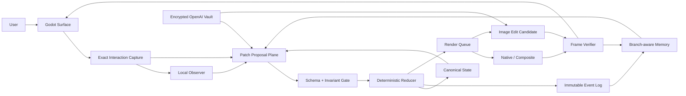

# Simulation AI Architecture

Simulation AI is an event-sourced world-surface runtime. The visible application
is a projection of typed semantic state, not the state itself.

## Authority hierarchy

1. Rights, privacy, and retention policy.
2. State schemas, protected paths, preconditions, and invariants.
3. Deterministic reducer, content-addressed states, event envelopes, and branch refs.
4. Observer, planner, critic, memory, and render proposals.
5. Candidate generated pixels.

## Operational planes

### Sensor plane

Godot records exact interaction telemetry. Sensitive typing is represented by
accepted character count and control class, never content.

### Credential control plane

OpenAI credentials are operational configuration, not semantic world state. A
separate password-wrapped vault uses scrypt and AES-256-GCM. Its routes expose
redacted status only and never append events, evidence, memory, render jobs, or
frame manifests. An unlocked key may be consumed by proposal and image adapters
without granting either adapter commit authority.

### Proposal plane

Local Gemma and GPT-class adapters can create observations, intent, patch
proposals, render plans, and memory suggestions. They cannot write canonical
state.

### Commit plane

The Python core validates authorized JSON-pointer paths, applies the patch to an
isolated state copy, runs invariants, seals the state, appends a hashed event,
and atomically updates the active branch ref.

### Memory plane

Memory records link event hashes, evidence IDs, state hashes, object IDs,
epistemic class, confidence, branch, and retention policy. Retrieval blends
lexical similarity, object overlap, branch match, verification quality, and
failure/contradiction relevance.

### Render plane

Native and composite jobs verify immediately. Image-edit and new-keyframe jobs
remain queued until an explicit verifier decision. Retry exhaustion falls back
to deterministic presentation.

## Product invariant

> Deterministic telemetry records what the user physically did. Models describe
> what it may mean. Validated reducers decide what changed. Renderers show the
> committed result. Memory preserves how the system reached it.
