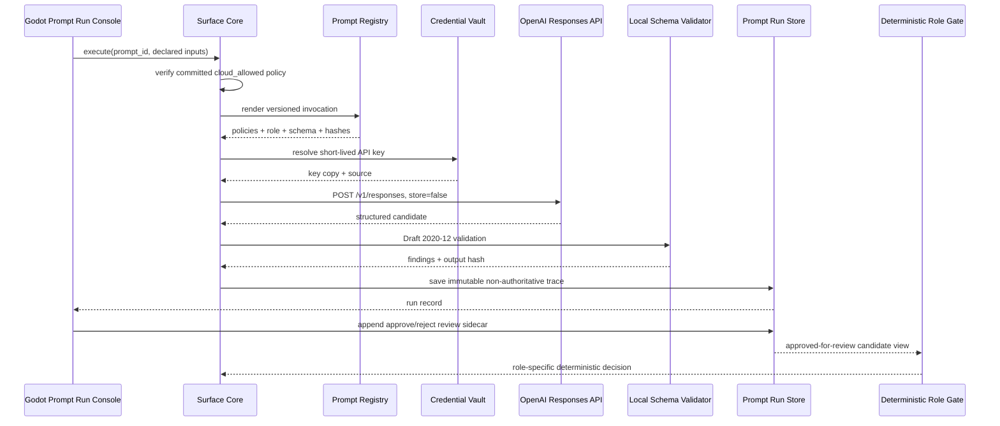
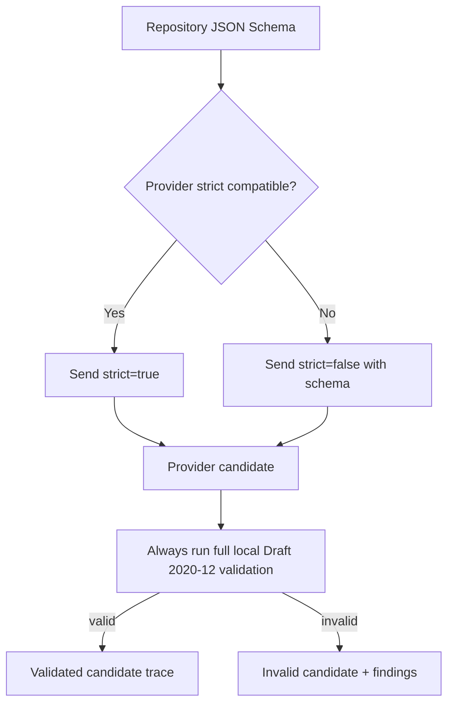
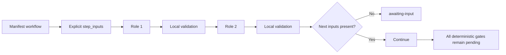

# Governed Model Execution

Simulation AI can dispatch a versioned role prompt through the OpenAI Responses
API, but the provider is never part of the commit authority. The execution plane
produces immutable candidate traces that must pass local schema validation,
human review when required, and a role-specific deterministic gate.

## Execution pipeline



Human approval does not commit state. It means only that the operator permits
the candidate to advance to the next deterministic review boundary.

## Provider request

The executor sends:

- `model` from `SIMULATION_AI_OPENAI_MODEL` or the explicit UI override;
- shared policies and the selected role as `instructions`;
- the canonical escaped input envelope as `input`;
- a provider-safe JSON Schema under `text.format`, with local Draft metadata removed from the transport copy;
- a bounded reasoning effort and output-token limit;
- `store: false`;
- non-sensitive prompt, pack, and invocation identifiers as metadata.

The API key is added only to the HTTP Authorization header. It is never placed
in prompt text, request metadata, state, events, memory, run output, or the run
store. The repository schema remains unchanged and content-addressed; only the
deep-copied provider payload drops transport-irrelevant `$schema` and `$id` keys.

## Strict schema compatibility

Repository output contracts use full JSON Schema Draft 2020-12. The OpenAI
strict Structured Outputs subset is narrower. The registry therefore calculates
an explicit compatibility artifact for every role.



Provider strictness is an optimization, not the trust boundary. Full local
validation is always required.

## Prompt run artifact

A model execution creates `nmsr.prompt-run/1` containing:

- run, invocation, prompt, pack, request, and output hashes;
- provider response and request IDs;
- model, reasoning effort, attempts, latency, and safe token usage;
- parsed output and complete local validation findings;
- review status;
- `commit_authority: false`;
- `deterministic_gate_required: true`;
- `store_requested: false`.

The store is separate from semantic world history. Prompt execution does not
create a state, event, branch change, memory, render job, or frame manifest.
The base run file is immutable. Operator decisions are append-only review
sidecars, and the API overlays the newest review onto a derived read view.

## Workflow execution

A workflow run accepts explicit `step_inputs` keyed by prompt ID. Outputs are not
silently wired into later prompts. Missing step input stops the workflow with
`awaiting-input`, allowing the context mapper or operator to create an auditable
mapping first.



A workflow fails closed on provider error or, by default, schema-invalid output.
The workflow-failure-repair prompt may propose retry or fallback, but cannot
bypass security, rights, or deterministic gates.

## Environment configuration

```text
SIMULATION_AI_OPENAI_MODEL=gpt-5.6
SIMULATION_AI_OPENAI_REASONING_EFFORT=medium
SIMULATION_AI_OPENAI_MAX_OUTPUT_TOKENS=4096
SIMULATION_AI_OPENAI_TIMEOUT=60
SIMULATION_AI_OPENAI_MAX_ATTEMPTS=2
SIMULATION_AI_OPENAI_RESPONSES_URL=https://api.openai.com/v1/responses
```

The endpoint override exists for test doubles and approved gateways. The default
service still refuses non-loopback control-plane binding unless explicitly
enabled.

## Routes

```text
GET  /v1/model-execution/status
GET  /v1/prompt-runs?limit=50
GET  /v1/prompt-runs/{run_id}
GET  /v1/prompt-workflow-runs?limit=25
POST /v1/prompts/execute
POST /v1/prompt-runs/review
POST /v1/prompt-workflows/execute
```
