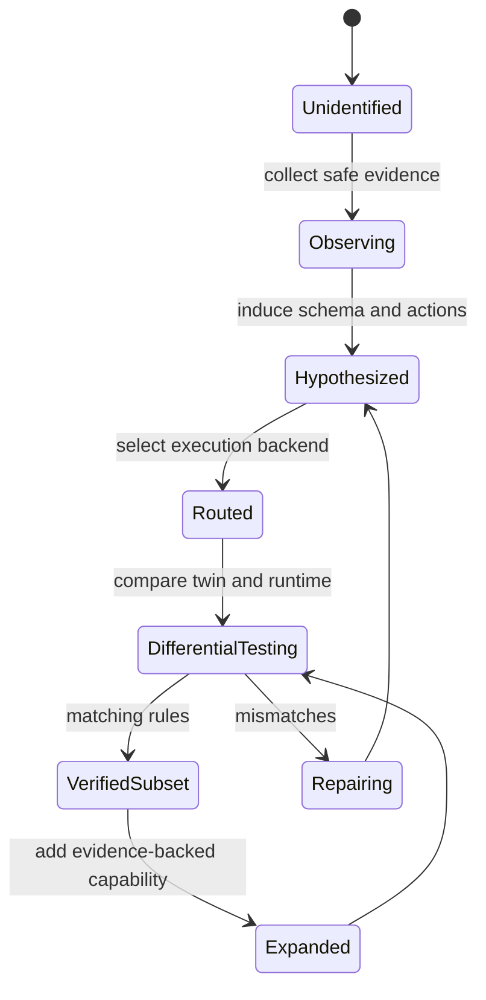

# Program Profiles and Universal Execution

A `ProgramProfile` is the unit that allows Simulation AI to model a program,
service, operating-system subsystem or complete guest OS.

```text
ProgramProfile =
  State Schema
  + Action Grammar
  + Reducer Bindings
  + Invariants
  + Runtime Route
  + Observer Bindings
  + Renderer Bindings
  + Capability / Permission Model
  + Known Gaps
```

## Discovery lifecycle



Profiles do not claim universal compatibility. Every capability is labeled as
observed, inferred, emulated, proxied or unsupported. A profile can begin as a
small semantic twin and later attach a container, VM, emulator or remote runtime
for greater fidelity.

## Runtime strategies

- Semantic twin
- API or protocol emulator
- Managed runtime or WebAssembly
- Container or native sandbox
- Compatibility layer
- Virtual machine
- Hardware emulator
- Connected remote machine
- Unsupported

The runtime router favors the simplest isolated backend that satisfies the
requested fidelity. Unknown binaries are never routed to unsandboxed native
execution by prompt output alone.
