# Simulation AI: A Persistent Semantic Computer

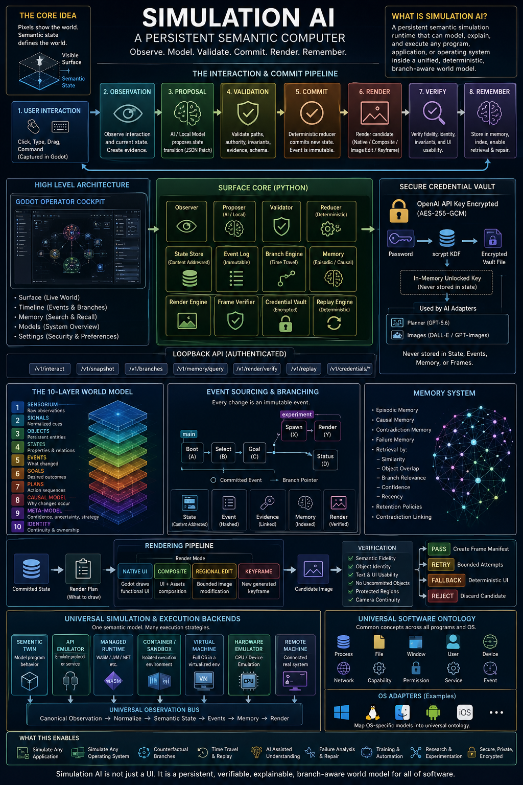

## 1. The central idea

Simulation AI is not fundamentally a game, a chatbot, or an image generator.

It is a **persistent semantic simulation runtime**.

The program maintains an authoritative description of a world. That world can represent a city, a desktop, a mobile application, an operating system, a network, a game, a company, or another software environment.

The visible interface is only a projection of that deeper state.

This distinction is the foundation of the entire architecture:

> Pixels show the world.
> Semantic state defines the world.

A screenshot might show a window, a button, and a document. But the underlying state contains much more:

* Which window is focused
* What the button does
* Which document is open
* Whether it has unsaved changes
* What permissions exist
* Which process owns the window
* What actions are valid
* What happened previously
* What alternatives could have happened
* What evidence supports each claim

Simulation AI stores this deeper structure and produces a visible surface from it.

---

# 2. Whole-program architecture

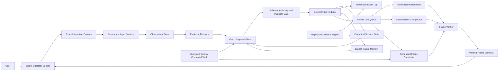

The most important authority rule is:

```text
Models may propose.
Validators may approve.
The deterministic core commits.
Renderers display.
```

Neither a language model nor an image model directly changes the authoritative world.

---

# 3. The Godot application

Godot is the visible operator surface.

The important files are:

```text
ui/main.gd
ui/world_canvas.gd
ui/theme_factory.gd
systems/interaction_capture.gd
systems/surface_bridge.gd
```

## `main.gd`

This creates the application shell and its major pages:

* Surface
* Timeline
* Memory
* Models
* Settings

The Surface page displays the live semantic topology. Objects such as the observer, planner, memory store, renderer, and world surface appear as interactive nodes.

The Timeline page shows committed events and available branches.

The Memory page searches episodic, causal, contradiction, and failure memories.

The Models page explains which components have authority and which are proposal-only.

The Settings page controls privacy, rendering policy, motion preferences, authentication, and the encrypted OpenAI credential vault.

## `world_canvas.gd`

The world canvas renders the semantic object graph.

An object is not merely a picture. It has an identity and properties such as:

```json
{
  "type": "store",
  "label": "Memoric Store",
  "status": "indexed",
  "epistemic_class": "observed",
  "layout": [0.76, 0.34],
  "properties": {
    "branch_aware": true,
    "contradiction_retention": true
  }
}
```

The canvas supports:

* Selecting objects
* Panning
* Zooming
* Dragging
* Inspecting object state
* Sending semantic commands
* Showing relationships between objects

## `interaction_capture.gd`

This records what the user physically does.

Examples include:

* Click
* Double-click
* Drag
* Scroll
* Focus change
* Command submission
* Keyboard input
* Text entry

The capture layer creates normalized interaction packets.

Sensitive controls do not transmit password or API-key text. Instead, they can record facts such as:

```json
{
  "action": "text_input",
  "target_id": "settings.openai_key",
  "arguments": {
    "sensitive": true,
    "accepted_character_count": 164
  }
}
```

The system knows that text was entered, but semantic logs do not receive the secret.

## `surface_bridge.gd`

The bridge connects Godot to the local Python Surface Core.

It sends requests to loopback endpoints such as:

```text
/v1/interact
/v1/snapshot
/v1/branches
/v1/memory/query
/v1/render/verify
/v1/replay
/v1/credentials/openai
```

When the Python service is unavailable, the interface retains a deterministic local preview rather than becoming completely unusable.

---

# 4. The Python Surface Core

The Python service is the authoritative simulation engine.

Its principal modules are:

```text
engine.py
model.py
validation.py
store.py
adapters.py
memory.py
render.py
credentials.py
server.py
```

## `model.py`

This defines the typed contracts used throughout the runtime.

Important structures include:

* `SurfaceState`
* `EvidenceRecord`
* `ObservationReport`
* `PatchOperation`
* `PatchProposal`
* `EventEnvelope`
* `MemoryRecord`
* `RenderJob`
* `FrameManifest`

Every important artifact is serializable and hashable.

The state hash is calculated from canonical JSON:

```text
state_hash = SHA-256(canonical_state_payload)
```

Two states with identical semantic content therefore produce identical hashes.

## `engine.py`

`SurfaceEngine` coordinates the whole simulation.

Its major operations are:

```text
boot
current
snapshot
observe
propose
commit_proposal
interact
create_branch
switch_branch
query_memory
verify_render
verify_replay
```

The common `interact` operation runs the full pipeline:

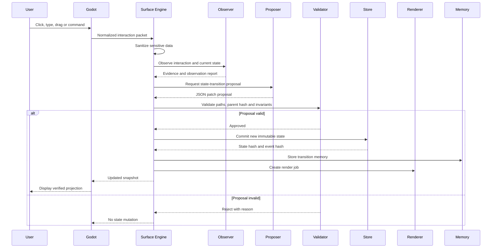

---

# 5. Observation, proposal and commit

These are deliberately separate stages.

## Observation

An observation says what appears to have happened.

For example:

```json
{
  "action": {
    "kind": "click",
    "target": "node.memory"
  },
  "candidate_effects": [
    {
      "effect": "select_object",
      "object_id": "node.memory"
    }
  ],
  "confidence": 1.0,
  "source": "deterministic-observer"
}
```

Observation produces evidence, not authority.

## Proposal

A proposer turns evidence and intent into a candidate patch:

```json
{
  "parent_state_hash": "abc123",
  "operations": [
    {
      "op": "replace",
      "path": "/selected_object_id",
      "value": "node.memory",
      "evidence_ids": ["evidence_42"],
      "epistemic_class": "observed",
      "confidence": 1.0
    }
  ]
}
```

A future local Gemma observer or OpenAI-backed planner can produce this proposal. The present repository also contains deterministic fallback adapters.

## Validation

The validator checks:

* Is the parent state still current?
* Is the operation allowed?
* Is the JSON-pointer path writable?
* Is the value structurally valid?
* Does the evidence exist?
* Are protected fields untouched?
* Do postconditions hold?
* Do system invariants still hold?

Protected values include state hashes, identity fields, provenance fields, branch authority, and other core metadata.

## Commit

Only after validation does the reducer create a new state.

Conceptually:

[
S_{t+1} =
\operatorname{Seal}
\left(
\operatorname{Validate}
\left(
\operatorname{Reduce}(S_t, E_t, P_t)
\right)
\right)
]

Where:

* (S_t) is the current state
* (E_t) is observed evidence
* (P_t) is a proposal
* (S_{t+1}) is the committed next state

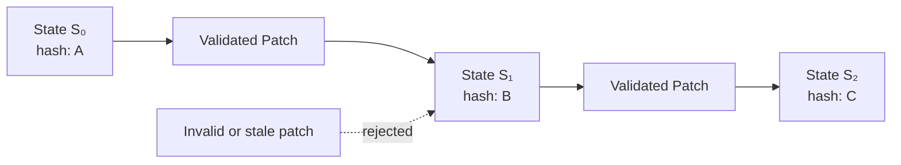

A stale proposal cannot commit against a state that has already changed.

---

# 6. The ten-layer world model

The canonical state is organized around ten conceptual layers.

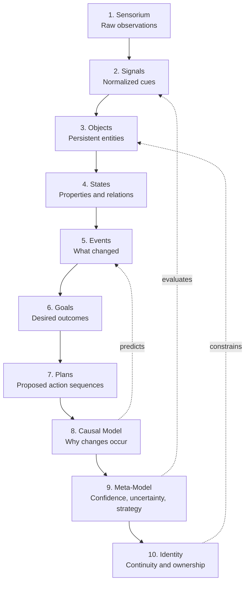

This allows Simulation AI to distinguish between:

* What was directly observed
* What was inferred
* What is merely possible
* What belongs to a counterfactual branch
* What remains unknown

The supported epistemic classes are:

```text
observed
inferred
counterfactual
speculative
unknown
```

This is essential for a reliable simulator. It prevents an AI guess from quietly being stored as a fact.

---

# 7. Event sourcing, replay and branching

Simulation AI does not overwrite history.

Each committed transition creates:

1. A new content-addressed state
2. A hashed event envelope
3. One or more evidence links
4. A proposal reference
5. A memory record
6. A render job
7. Eventually, a verified frame manifest

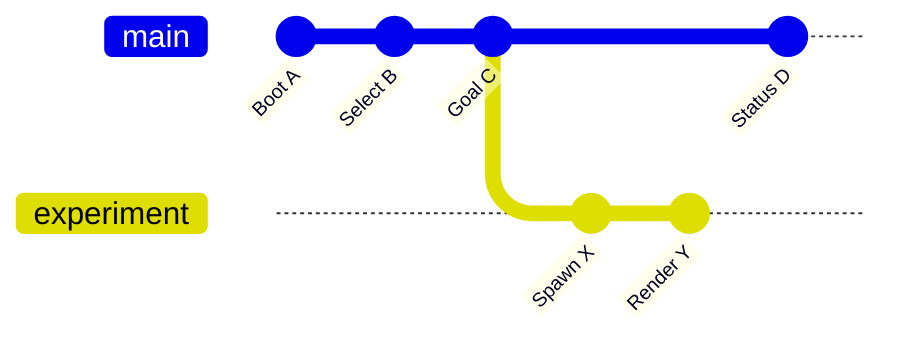

A branch is a named pointer to a state hash.

Creating a branch does not copy the whole universe. It creates a new reference to an existing immutable state. New events then extend that branch independently.

This enables:

* Undo without destructive deletion
* Time travel
* Counterfactual simulations
* Experiment comparison
* Replaying failures
* Testing alternate user decisions
* Comparing AI plans
* Returning to verified checkpoints

Replay recalculates the event chain and state transitions. If a hash differs, the history is no longer considered verified.

---

# 8. Memory

Memory is not a single chat transcript.

Each memory can link:

* Event hashes
* State hashes
* Evidence IDs
* Object IDs
* Branch
* Confidence
* Epistemic class
* Contradictions
* Superseded memories
* Retention policy
* Logical time

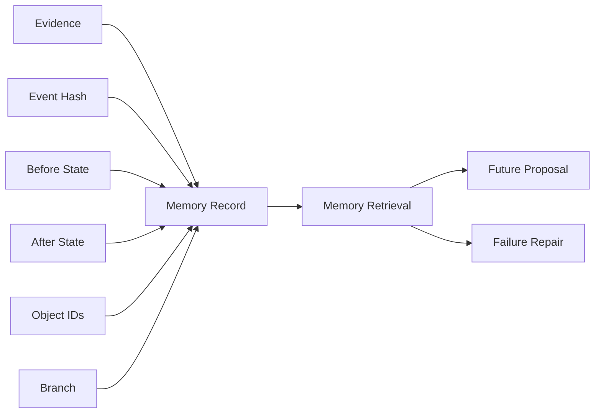

Retrieval can rank memory using:

* Text similarity
* Object overlap
* Branch relevance
* Confidence
* Verification status
* Contradiction relevance
* Failure relevance
* Recency

Failures are preserved instead of being summarized away. This allows the system to learn that a previous plan failed under particular conditions.

---

# 9. Rendering

A render is not automatically trusted.

Simulation AI supports four render classes:

```text
native_ui
composite
regional_image_edit
new_keyframe
```

## Native UI

Godot draws buttons, labels, panels, nodes, forms, cursors and deterministic animations.

This is best for functional interface elements.

## Composite

Godot combines native UI with existing generated or procedural visual assets.

## Regional image edit

Only a bounded region is regenerated. Unaffected objects and functional UI are preserved.

## New keyframe

A more substantial visual projection is generated from committed state.

The result remains a candidate until it passes verification.

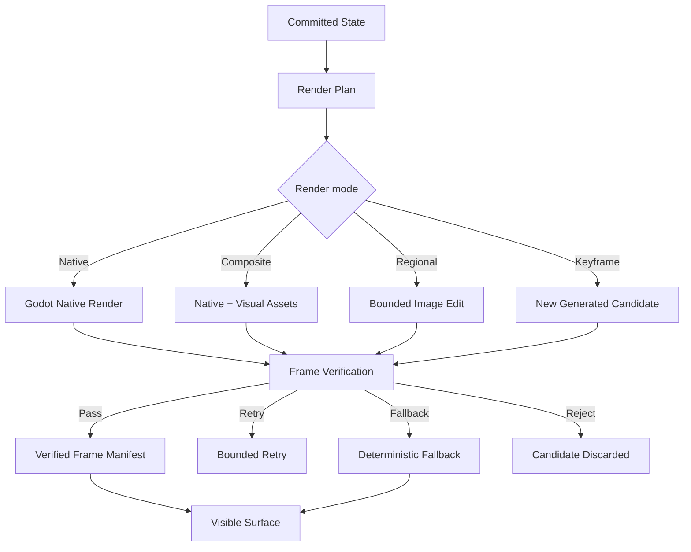

Verification checks:

* Semantic fidelity
* Object identity
* Camera continuity
* Protected regions
* Functional text
* UI usability
* Uncommitted objects
* Unexpected visual mutations

The primary invariant remains:

> A generated frame may illustrate committed state. It may never silently become committed state.

---

# 10. The encrypted OpenAI credential vault

The OpenAI credential system is intentionally outside the semantic world.

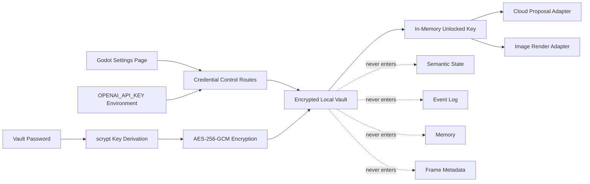

The UI supports:

* Saving a key encrypted
* Importing the server’s environment key
* Unlocking
* Locking
* Testing authentication
* Clearing the vault

Only redacted metadata is returned:

* Configured or not
* Locked or unlocked
* Source
* Creation date
* Short fingerprint

The full key is never returned to Godot.

---

# 11. What does “simulate a program” mean?

There are several different levels of simulation.

They should not be confused.

## Level 1: Interface simulation

The system reproduces screens and interactions.

For example, it could show a simulated text editor with menus, tabs and a document area.

This is useful for:

* Training
* Prototyping
* Demonstrations
* Interface testing

But it may not execute the original application.

## Level 2: Semantic behavioral simulation

The system models the program’s actual concepts and rules.

For a text editor, the canonical state might contain:

```text
documents
tabs
cursor position
selection
undo stack
encoding
dirty state
file path
permissions
```

Typing changes the document through a deterministic reducer. Saving changes its dirty state. Undo reverses a committed operation.

This is much deeper than drawing a fake editor.

## Level 3: API or protocol emulation

The simulator implements the external contract of another program or service.

Examples:

* A filesystem API
* A database protocol
* A messaging service
* A package manager
* A web application backend
* A network device

Other software can communicate with the simulator as though it were the original service.

## Level 4: Compatibility execution

The original program runs through a compatible runtime.

Examples of runtime classes include:

* WebAssembly runtime
* Java virtual machine
* Managed-language runtime
* Container
* Operating-system compatibility layer

Simulation AI would observe and orchestrate the runtime rather than rewrite every program semantically.

## Level 5: Full-system virtualization

A complete guest operating system executes in a virtual machine.

This includes:

* Guest kernel
* Processes
* Virtual memory
* Filesystem
* Virtual devices
* Network interfaces
* Display output

Simulation AI can control, inspect, snapshot and explain the VM, while the hypervisor executes the real guest code.

## Level 6: Hardware emulation

A CPU and its devices are emulated instruction by instruction or block by block.

This is required for software made for different hardware architectures or old machines.

---

# 12. The universal simulator concept

The expanded vision is a **universal semantic hypervisor**.

It would not use one technique for every program. Instead, it would route each target to the most suitable simulation backend.

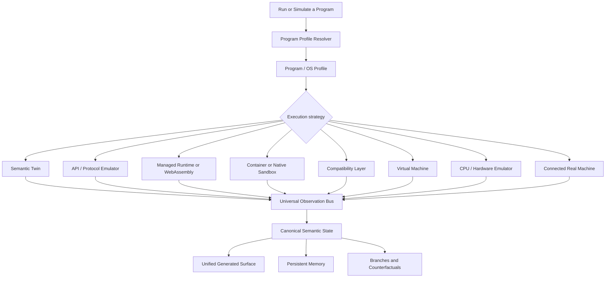

Simulation AI becomes the common control and understanding layer above many execution systems.

It does not have to replace virtualization, containers or emulators. It coordinates them and translates their state into a common semantic representation.

---

# 13. The program profile

To simulate a new program, the system needs a profile.

Conceptually:

[
\text{ProgramProfile} =
\text{State Schema}
+
\text{Action Grammar}
+
\text{Reducer}
+
\text{Invariants}
+
\text{Renderer}
+
\text{Runtime Adapter}
+
\text{Observer}
]

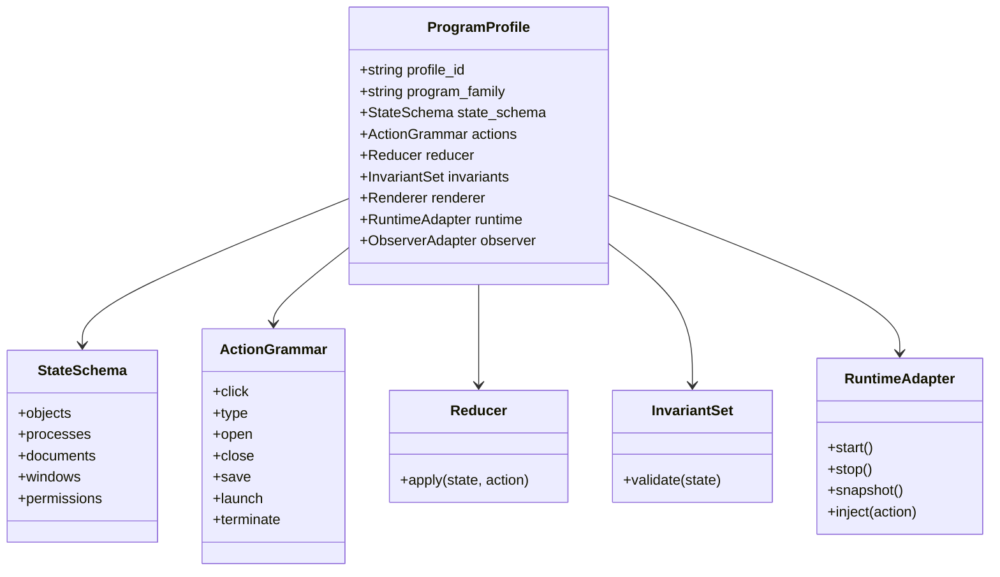

For a calculator, the profile is small.

For an office suite, it is larger.

For an operating system, it becomes a collection of linked profiles.

---

# 14. Simulating an operating system

An operating system is not one screen. It is a coordinated collection of subsystems.

A serious OS state model would include:

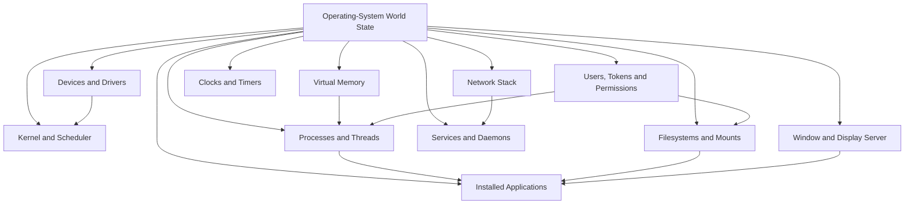

The simulator would represent objects such as:

```text
os.kernel
process.1042
thread.1042.1
window.browser.main
file./home/user/report.txt
device.display.0
network.interface.eth0
user.operator
permission.file.write
service.audio
```

Actions would include:

```text
launch process
terminate process
open file
write file
allocate memory
create window
send packet
mount filesystem
change permission
install package
start service
```

The deterministic core would check OS-specific invariants.

For example:

* A terminated process cannot own an active thread.
* A file cannot be written without permission.
* A window must belong to a live process.
* Memory mappings must belong to valid address spaces.
* A network connection must reference valid endpoints.
* A mounted filesystem must reference an available device or virtual volume.

---

# 15. How one interface could represent many operating systems

The canonical state does not need every operating system to use identical internal concepts.

Instead, Simulation AI can use a universal ontology with system-specific extensions.

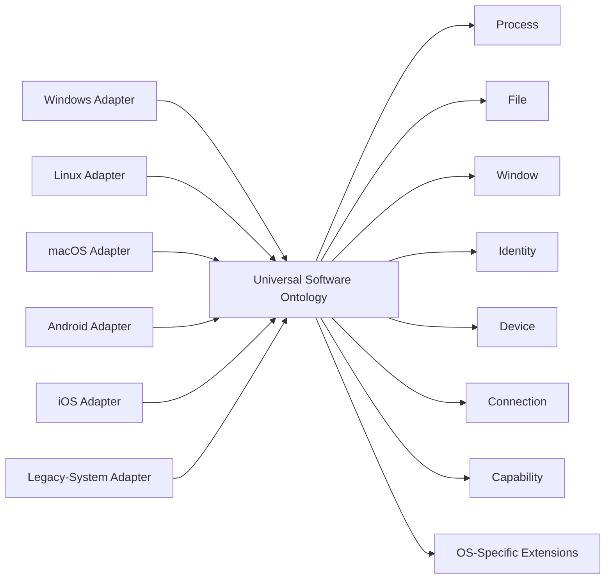

A universal `process` object might contain common fields:

```text
identity
owner
status
executable
resources
children
capabilities
visible surfaces
```

A Linux adapter could add namespaces and control groups.

Another OS adapter could add application containers, security tokens, registries, bundles or platform-specific lifecycle states.

The universal layer handles common reasoning while extensions preserve system-specific behavior.

---

# 16. How AI helps

AI is useful where exact translation is difficult.

It can:

* Infer user intent from low-level interaction
* Map unfamiliar interfaces into known semantic concepts
* Generate candidate program profiles
* Propose state transitions
* Explain system behavior
* Identify likely causes of failures
* Suggest missing invariants
* Translate between application ontologies
* Generate visual keyframes
* Summarize long execution histories
* Propose counterfactual experiments

But it should not be responsible for:

* Silently committing state
* Inventing permissions
* Bypassing program invariants
* Treating pixels as ground truth
* Hiding uncertainty
* Storing secrets in prompts or memory
* Declaring an emulation exact without verification

The AI is the interpreter and planner. The deterministic runtime is the authority.

---

# 17. Simulating a previously unknown application

Suppose the system encounters a program without an existing profile.

It could enter a discovery cycle:

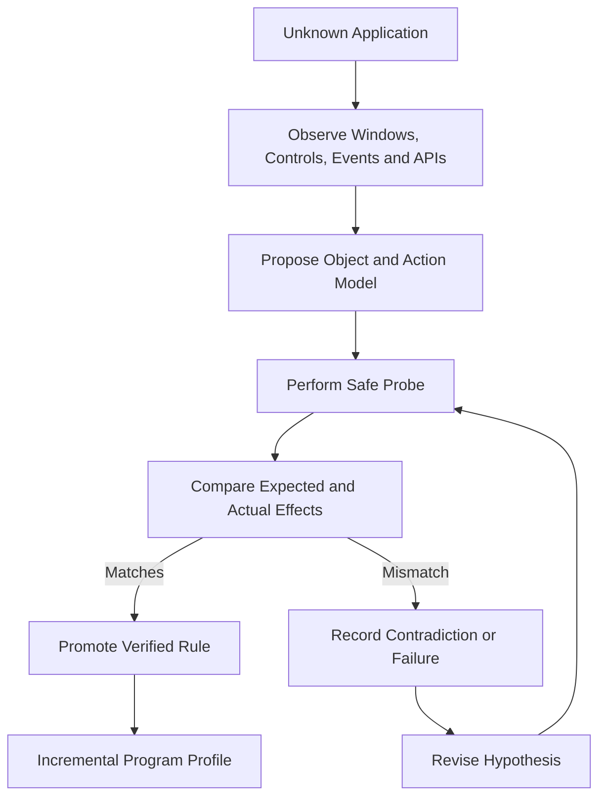

The first version might know only that clicking a control opens a panel.

Later, it may learn:

* The panel edits a document property
* The property persists to a file
* The action has an undo operation
* The control is disabled under certain permissions

Verified rules gradually replace speculative ones.

---

# 18. One program simulated two ways

Consider a file manager.

## Semantic twin

Simulation AI implements its own file-manager state and reducer.

Advantages:

* Fully controllable
* Deterministic
* Easy branching
* Excellent for training and planning

Limitations:

* It may not match every bug and edge case of the original product

## Real runtime adapter

The actual file manager runs inside a container, VM or remote system.

Simulation AI observes its windows, process state, filesystem calls and events.

Advantages:

* Executes the real implementation
* Captures genuine behavior

Limitations:

* Harder to control
* Less deterministic
* Requires stronger isolation
* Internal state may be partially invisible

The strongest system combines both:

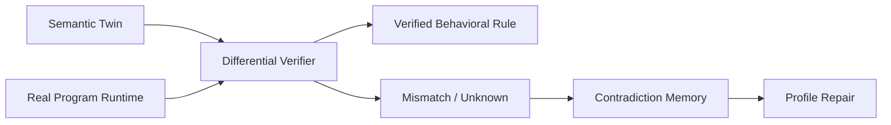

The semantic twin predicts what should happen. The real runtime reveals what actually happens. Differences improve the model.

---

# 19. What “simulate all programs” can realistically mean

Simulation AI cannot currently run every application or operating system.

No single system can automatically guarantee perfect simulation of every possible program, machine, proprietary service, device, timing condition and undocumented behavior.

Some obstacles are fundamental:

* Missing specifications
* Proprietary code and assets
* Hardware-specific behavior
* External servers
* Nondeterministic timing
* Physical sensors
* Licensing restrictions
* Anti-tamper systems
* Encrypted protocols
* Malware
* Distributed dependencies
* Programs that modify themselves
* Unknown environmental assumptions

A technically honest goal is:

> Build a universal framework capable of representing, executing, observing or approximating any software system through replaceable profiles and execution backends.

That means “universal” refers to the architecture’s extensibility, not a magical claim that every program is already implemented.

---

# 20. The long-term platform

The mature platform could have five main layers.

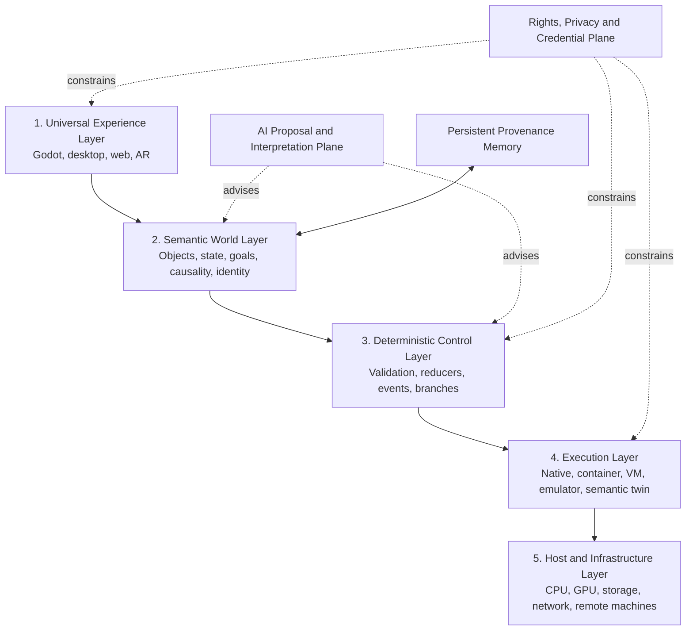

The user would interact with one continuous surface.

Behind it, a particular object might be:

* A purely simulated application
* A real local process
* A container
* A virtual machine
* A remote computer
* A generated environment
* A historical operating system
* A counterfactual branch
* An AI-designed program that has never existed before

The surface would make these systems appear coherent while preserving their different authority and confidence levels.

---

# 21. The deepest concept

Traditional computers expose files, windows, processes and applications.

Simulation AI adds another layer above them: a persistent model of meaning.

It attempts to answer not only:

```text
What pixels are visible?
```

but also:

```text
What objects exist?
What is their state?
Why did they change?
What evidence supports that?
What is uncertain?
What is the user trying to achieve?
What alternate future should be tested?
How can this state be reproduced?
```

That makes the system closer to a **semantic operating environment** than a conventional application.

Its essential loop is:

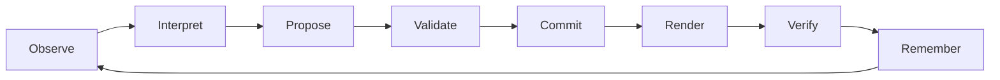

The complete principle can be stated as:

> Every program becomes a world.
> Every interaction becomes evidence.
> Every accepted change becomes a replayable event.
> Every screen becomes a projection.
> Every uncertainty remains labeled.
> Every alternative future becomes a branch.

That is how Simulation AI can grow from its present semantic-surface prototype into a framework capable of modeling applications, operating systems, networks and entire software worlds.
